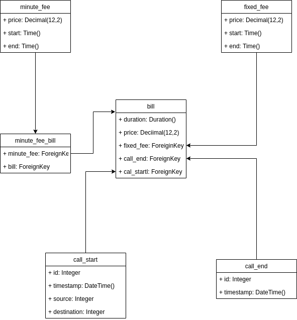

# Call Records


*****

## Section
- [Libraries](#libraries)
- [My Work Environment](#my-work-environment)
- [Database Diagram Design](#database-diagram-design)
- [App Heroku](#heroku)
- [Instructions' install](#instructions-install)
- [Endpoints Doc](docs/endpoints.md)

## Libraries
- django-model-utils
- python-dateutil
- pytest
- pytest-django
- pytest-cov
- factory_boy
- flake8
- django
- djangorestframework
- django-filter


*****
## My Work Environment
|Type |Model|
|------|------|
|CPU|Intel(R) Core(TM) i5-3470 CPU @ 3.20GHz|
|RAM|2x4GB hyperx fury ddr3 1600mhz|
|Monitor|LG ELECTRONICS 23MP55|
|Disk|ST500DM002-1BD14|
|Motherboard|B75M-D3H|
|OS|Debian GNU/Linux 9 (stretch) Cinnamon|
|IDE/Text Editor| Pycharm, Atom, Vim|


*****
## Database Diagram Design




*****

## Heroku

url: https://callrecords-subaru.herokuapp.com/

|login|password|
|----|----|
|callrecords|callrecords|

## Instructions' install

#### 0 - Create VirtualEnv (Opcional)
- Linuxers: [Pyenv VirtualEnv](https://github.com/pyenv/pyenv-virtualenv)
- Windows: [Anaconda](https://www.anaconda.com/distribution/)

#### 1 - Clone project github:

```
$ git clone git@github.com:tiagovizoto/work-at-olist.git
```

##### 2 - Access the folder


```
$ cd work-at-olist/callrecords
```

#### 3 - Install requirements
```
$ pip install -r requirements/test.txt
```

#### 4 - Migrate Database
```
python manage.py migrate
```
#### 5 - Local variable

> [examples format url databases](https://github.com/kennethreitz/dj-database-url)
 
```
export DATABASE_URL=postgres://$USER@$HOST/$DB
```

#### 6 - Run Tests \o/
```
pytest
```

#### 7 - Create a superuser
```
python manage.py createsuperuser
```

#### 8 - Run project
```
python manage.py runserver
```

*****
